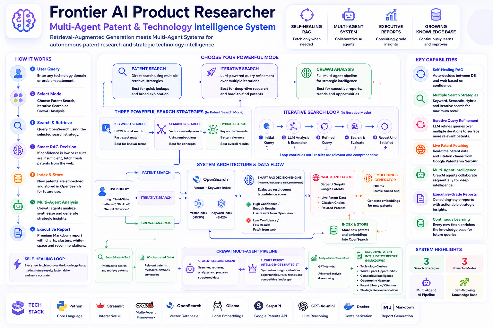
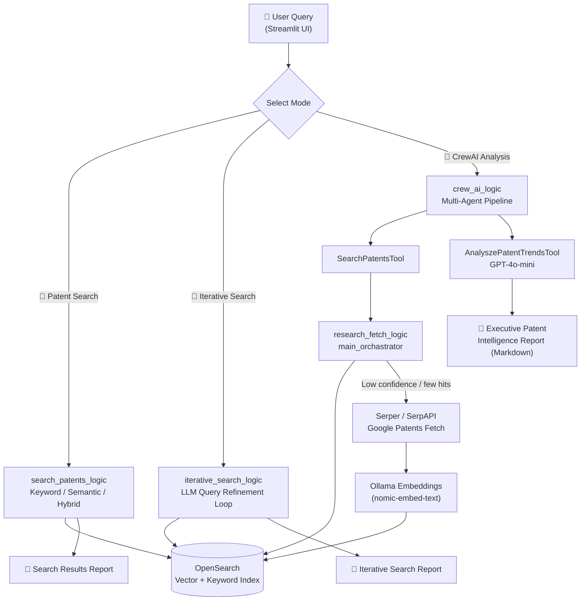

<div align="center">

# 🧠 Frontier AI Product Researcher — MAS-RAG

### Multi-Agent Patent & Technology Intelligence System

*Retrieval-Augmented Generation meets Multi-Agent Systems for autonomous patent research and strategic technology intelligence.*



</div>

---

## 📖 Overview

**Frontier AI Product Researcher** is a multi-agent, RAG-powered patent intelligence system. Give it a technology domain (e.g. *"Bio Fuel"*, *"Solid-State Batteries"*, *"Neural Networks"*) and it will:

1. **Check** a local vector knowledge base (OpenSearch) for relevant patents.
2. **Fetch** fresh patent data from the web (via SerpAPI/Google Patents) if the local knowledge base doesn't have strong matches.
3. **Index** new patents with embeddings for future queries (self-growing knowledge base).
4. **Retrieve** results using Keyword, Semantic, Hybrid, or **Iterative** (LLM-refined, multi-step) search.
5. **Synthesize** everything into a premium, consulting-grade Markdown intelligence report using a **CrewAI multi-agent pipeline**.

The end result is an executive-style report (think Gartner / McKinsey / BCG style output) covering technology clusters, white-space opportunities, competitive intelligence, and a referenced patent library — all generated automatically.

---

## ✨ Key Features

| Feature | Description |
|---|---|
| 🔁 **Self-Healing RAG** | Automatically decides whether to serve from the vector DB or fetch new data from the web based on result count & confidence score |
| 🧠 **Multi-Agent Analysis** | A `Patent Research Agent` + `Chief Patent Intelligence Strategist Agent` (CrewAI) collaborate sequentially to research and then synthesize findings |
| 🔎 **3 Retrieval Modes** | Keyword Search, Semantic (vector) Search, and Hybrid Search over OpenSearch |
| 🚀 **Iterative Query Refinement** | Automatically rewrites and narrows the search query over multiple LLM-guided iterations to surface more relevant patents |
| 🌐 **Live Patent Fetching** | Pulls real patent data + citation chains from Google Patents via SerpAPI |
| 📊 **Executive-Grade Reports** | Auto-generates tables for tech clusters, opportunity heatmaps, white-space analysis, competitive intelligence, and a patent reference library |
| 🖥️ **Interactive UI** | Streamlit front-end with mode switching, sliders, and downloadable Markdown reports |
| 🐳 **Dockerized Vector Store** | OpenSearch + OpenSearch Dashboards ready to go via `docker-compose` |

---

## 🏗️ Architecture



**Decision logic (`db_search_orchestrator.py`):** the system runs a hybrid search first. If fewer than 6 relevant chunks are found, or the top relevance score is low / too close to the second-best score, it automatically calls the Serper/SerpAPI fetcher to pull fresh patents from the web and indexes them — keeping the local knowledge base continuously up to date.

---

## 🔍 How It Works — The Three Core Engines

This project is built around **three independent retrieval engines**, all wired into one Streamlit app. Here's exactly what each one does, end‑to‑end:

### 1️⃣ Smart RAG Engine — "Check DB first, fetch from the web only if needed"

> *Used inside the CrewAI Analysis mode, via `research_fetch_logic`.*

1. The user enters a query (e.g. *"Bio Fuel"*).
2. The system **first checks OpenSearch** for similar/existing patent documents (hybrid vector + keyword search).
3. **If good matches already exist** (enough results + high confidence score) → it skips the web entirely and serves the answer instantly from the local database. ✅ Fast, free, no API calls.
4. **If no good matches are found** (too few results, or low/ambiguous confidence) → the system automatically:
   - Calls **SerpAPI** (Google Patents) to fetch fresh, real patent data + their citation chains from the web,
   - Generates **embeddings** for the new data using **Ollama (`nomic-embed-text`)**,
   - **Stores/indexes** these new patents into OpenSearch so the next query on a similar topic is instantly served from cache,
   - Returns the freshly fetched + embedded results back to the user.

This means the knowledge base **grows on its own** every time it encounters something new — classic self-healing RAG. 🔁

<details>
<summary>🔬 The exact "cache vs. fetch" decision rule (from <code>db_search_orchestrator.py</code>)</summary>

1. Run a hybrid search against OpenSearch.
2. **If fewer than 6 results** → fetch fresh patents from SerpAPI and index them.
3. **Else**, compare the top two relevance scores:
   - If the top score is low (`< 0.9`) → fetch fresh data.
   - If the top score is decent but too close to the runner-up (`< 1.0` and gap `< 0.15`) → fetch fresh data (the match isn't confident/unique enough).
   - Otherwise → serve directly from the existing index (fast path, no extra API calls).

This keeps the system cost-efficient (no unnecessary SerpAPI calls) while ensuring the knowledge base stays current.
</details>

### 2️⃣ Multi-Mode Search Engine — Keyword / Semantic / Hybrid

> *Used in the "🔎 Patent Search" mode, via `search_patents_logic`.*

1. The user picks one of three search strategies:
   - **🔎 Keyword Search** — plain text/BM25 match against patent abstracts.
   - **🧠 Semantic Search** — vector (kNN) similarity using Ollama embeddings, so it understands *meaning*, not just exact words.
   - **⚡ Hybrid Search** — combines both keyword + vector scoring for the best of both worlds.
2. Results are deduplicated by patent ID and ranked by relevance score.
3. Instead of dumping raw JSON/text, the results are **formatted into clean, styled Markdown** (titles, patent IDs, scores, dates, abstracts, dividers, emojis) — so it actually looks good and readable on screen, not like a database dump.
4. The user can also **download the Markdown report** directly from the UI.

### 3️⃣ Iterative Query Refinement Engine — "Let the LLM sharpen the query for you"

> *Used in the "🚀 Iterative Patent Search" mode, via `iterative_search_logic`.*

The user provides a **query** + the **number of steps** they want to iterate. For each step:

1. The system searches the current query against OpenSearch.
2. It takes the **most relevant (top‑ranked) result** and extracts its **title**.
3. That title is combined with the original query and sent to an **LLM (GPT‑4o‑mini)**, which rewrites/fuses them into a **shorter, more efficient search query**.
4. The system then **re-searches** OpenSearch using this new, sharper query — and repeats the cycle for the chosen number of steps.

Each step's query is saved, so the final report shows the full **"Query Evolution"** trail — e.g. `Bio Fuel → Bio Fuel + [top patent title] → refined query → ...` — so the user can literally see the search getting smarter with every iteration.

As with the other modes, the final output is rendered as **polished Markdown** (top matches, query evolution steps, detailed result cards) rather than plain text, and is downloadable from the UI.

### 🌟 The Main Entry Point: `streamlit_app.py`

All three engines above are wired together inside **`streamlit_app.py`** — this is the file you actually run. To get the *full* experience (all three modes working correctly), make sure these three things are running **before** you launch it:

| Requirement | Why it's needed |
|---|---|
| 🐳 **OpenSearch running** (`docker-compose up -d`) | Stores & retrieves all patent vectors + text |
| 🦙 **Ollama running**, with `nomic-embed-text` pulled | Generates embeddings for semantic/hybrid search and new patent data |
| 🔑 **`.env` set up** with `OPEN_AI_API` + `SERPER_API_KEY` | Powers the LLM query refinement, CrewAI agents, and live patent fetching |

> ✅ With all three running together, `streamlit_app.py` gives you the complete, intended experience: instant cached search, live self-updating RAG, and LLM-refined iterative retrieval — all rendered as clean, presentable Markdown reports.

---

## 📂 Project Structure

```
Frontier-AI-Product-Researcher-MAS-RAG/
│
├── streamlit_app.py                 # 🌟 Main UI — 3-mode patent intelligence hub
├── app.py                           # Lightweight sample UI (calls sample.py stub)
├── sample.py                        # Placeholder hook for quick UI testing
├── main.py                          # CLI entry point for iterative search testing
│
├── crew_ai_logic/                   # 🧠 Multi-Agent System (CrewAI)
│   ├── crew_ai_agents.py            #   Agent definitions (Researcher + Strategist)
│   ├── crew_ai_tasks.py             #   Task definitions for each agent
│   ├── crew_ai_tools.py             #   Custom tools: SearchPatentsTool, AnalyszePatentTrendsTool
│   └── crew_ai_generator.py         #   Crew orchestration entry point
│
├── research_fetch_logic/            # 🌐 Data fetching, embedding & indexing
│   ├── research_fetch_logic_main.py #   Top-level orchestrator
│   ├── db_search_orchestrator.py    #   Decides: serve from cache vs fetch fresh data
│   ├── data_ingestion.py            #   Loads/embeds/indexes patent JSON into OpenSearch
│   ├── db_index_initializer.py      #   Creates the OpenSearch knn index/mapping
│   ├── hybrid_search_logic.py       #   Hybrid (kNN + keyword) search
│   ├── ollama_embedding.py          #   Embeddings via Ollama (nomic-embed-text)
│   ├── open_search_client.py        #   OpenSearch client factory
│   ├── serper_fetcher.py            #   Fetches patents + citations via SerpAPI
│   └── serper_helper.py             #   SerpAPI URL/response helpers
│
├── search_patents_logic/            # 🔎 Standard retrieval modes
│   ├── retrival_methods.py          #   keyword_search / semantic_search / hybrid_search
│   └── search_logic_orchestrator.py #   Formats results into Markdown
│
├── iterative_search_logic/          # 🚀 Iterative, LLM-refined search
│   ├── iterative_search_function.py #   Core iteration loop + query rewriting (GPT-4o-mini)
│   └── iterative_main_orchastrator.py # Formats iterative results into Markdown
│
├── docker-compose.yml               # OpenSearch + OpenSearch Dashboards services
├── pyproject.toml                   # Project metadata (Python >= 3.13)
├── requirements.txt                 # Full dependency list
├── serper_sample.ipynb              # Notebook for exploring the SerpAPI patent response
└── .python-version
```

---

## 🛠️ Tech Stack

- **Language:** Python 3.13+
- **UI:** Streamlit
- **Multi-Agent Orchestration:** CrewAI
- **LLMs:** OpenAI `gpt-4o-mini` (agents, query refinement, trend analysis)
- **Embeddings:** Ollama (`nomic-embed-text`, local & free)
- **Vector / Search Store:** OpenSearch (kNN vector search + BM25 keyword search)
- **Web Data Source:** SerpAPI (Google Patents engine)
- **Supporting Libraries:** `langchain-core`, `pydantic`, `pandas`, `tiktoken`, `pdfplumber`, `requests`, `python-dotenv`

---

## ⚙️ Prerequisites

Before you start, make sure you have:

- **Python 3.13+**
- **Docker & Docker Compose** (for OpenSearch)
- **[Ollama](https://ollama.com/download)** installed locally, with the embedding model pulled:
  ```bash
  ollama pull nomic-embed-text
  ```
- An **OpenAI API key**
- A **SerpAPI key** ([serpapi.com](https://serpapi.com/)) for Google Patents data fetching

---

## 🚀 Getting Started

### 1. Clone the repository

```bash
git clone https://github.com/paras160500/Frontier-AI-Product-Researcher-MAS-RAG.git
cd Frontier-AI-Product-Researcher-MAS-RAG
```

### 2. Create a virtual environment & install dependencies

```bash
python -m venv .venv
source .venv/bin/activate      # On Windows: .venv\Scripts\activate

pip install -r requirements.txt
```

> 💡 This project also ships a `pyproject.toml`, so if you prefer [`uv`](https://docs.astral.sh/uv/) you can instead run:
> ```bash
> uv sync
> ```

### 3. Configure environment variables

Create a `.env` file in the project root:

```env
OPEN_AI_API=your_openai_api_key_here
SERPER_API_KEY=your_serpapi_key_here
```

| Variable | Used By | Purpose |
|---|---|---|
| `OPEN_AI_API` | `crew_ai_agents.py`, `iterative_search_function.py`, `crew_ai_tools.py` | Powers the CrewAI agents and the iterative query-refinement LLM calls |
| `SERPER_API_KEY` | `serper_fetcher.py`, `serper_helper.py` | Authenticates requests to SerpAPI's Google Patents engine |

### 4. Start OpenSearch (vector + keyword store)

```bash
docker-compose up -d
```

This spins up:
- **OpenSearch** → `http://localhost:9200`
- **OpenSearch Dashboards** → `http://localhost:5601`

### 5. Make sure Ollama is running

```bash
ollama serve
```
*(Most installs run this automatically as a background service.)*

### 6. Launch the app

```bash
streamlit run streamlit_app.py
```

Open the URL Streamlit prints (typically `http://localhost:8501`) in your browser. 🎉

---

## 🎮 Usage

Once `streamlit_app.py` is running, pick a mode from the radio selector and enter your query. See **[How It Works](#-how-it-works--the-three-core-engines)** above for the full explanation of each — quick reference:

| Mode | Engine | What you get |
|---|---|---|
| 🔎 **Patent Search** | Keyword / Semantic / Hybrid (engine #2) | Instant, ranked, deduplicated Markdown results from OpenSearch |
| 🚀 **Iterative Patent Search** | LLM query refinement (engine #3) | Multi-step refined search + a visible "Query Evolution" trail |
| 🧠 **Patent Analysis (CrewAI)** | Self-updating RAG (engine #1) + Multi-Agent report | A full executive-style patent intelligence report with tables, heatmaps & a reference library |

Every mode renders a clean Markdown report on screen and gives you a **📥 Download** button to save it as a `.md` file.

> ℹ️ `app.py` is a minimal/legacy sample UI wired to the `sample.py` stub — use `streamlit_app.py` for the real experience.

---

## 🗺️ Roadmap

- [ ] Replace `sample.py` stub with full production logic in `app.py`
- [ ] Add automated tests for retrieval & agent pipelines
- [ ] Add caching layer for repeated CrewAI analysis runs
- [ ] Support additional patent data sources beyond Google Patents
- [ ] Add citation graph visualization for prior-art exploration
- [ ] CI/CD pipeline & containerized app deployment (`Dockerfile` for the Streamlit app itself)

---

## 🤝 Contributing

Contributions, issues, and feature requests are welcome!

1. Fork the project
2. Create your feature branch (`git checkout -b feature/amazing-feature`)
3. Commit your changes (`git commit -m 'Add amazing feature'`)
4. Push to the branch (`git push origin feature/amazing-feature`)
5. Open a Pull Request

---

## 📄 License

This project is licensed under the **MIT License** — feel free to use, modify, and distribute it.
*(Add a `LICENSE` file to the repo root to formalize this.)*

---

## 🙋 Author

**Paras** — [@paras160500](https://github.com/paras160500)

If this project helped you, consider giving it a ⭐ on GitHub!